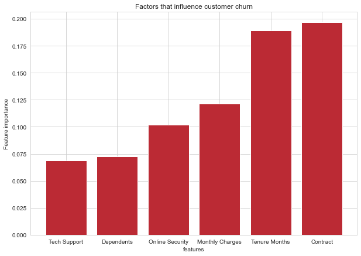
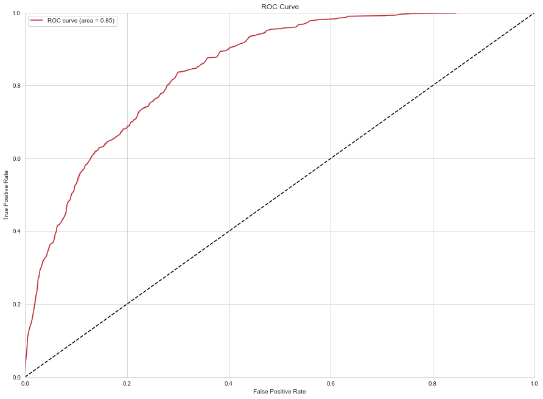

# Customer Churn Prediction
 

    
    

#### Introduction

"Customer churn" refers to the phenomenon when a customer stops doing business with a company. Predicting customer churn is an important task in the field of business analysis, as it can help companies to identify at-risk customers and take steps to retain them. In this project, a model is developed to predict customer churn for a fictional company called Swan-Teleco.

The goal of this project is to accurately predict which customers are at risk of leaving the company, so that targeted retention efforts can be made. The model uses a dataset that includes information about the customers, such as their demographic information, their account details, and their interactions with the company. Machine learning algorithms were applied to this dataset to train the model and make predictions about customer churn.

The performance of the model was evaluated using metrics such as accuracy, precision, recall, and AUC-ROC. The model achieved a good performance, which demonstrates the feasibility of using machine learning to predict customer churn. This project can be a valuable tool for Swan-Teleco to understand the factors that contribute to customer churn and take steps to prevent it, thus improving customer retention and overall business.

### EDA

There are a few insights that can be derived from the distribution of the features in the dataset:

    The Zip Code feature appears to be evenly distributed, with no clear outliers or anomalies.
    The Latitude and Longitude features have a fairly narrow range, with the majority of customers located within a small geographic area.
    The Tenure Months feature has a relatively wide range, with customers having been subscribers for anywhere from 1 to 72 months. The median of Tenure Months is 29, which indicates that half of the customers have been subscribers for less than 29 months, the other half for more than 29 months.
    The Monthly Charges feature also has a wide range, with customers paying anywhere from 18.25 to 118.75 dollars per month.
    The Churn Value feature has a mean of around 0.27, which means that around 27% of the customers in the dataset have churned.

In general, the dataset seems to be relatively evenly distributed across all features, except for the Churn Value where it has a mean of 0.27, indicating that a considerable percentage of the customer base has churned. Additionally, the distribution of Tenure Months suggest that customer's tenure is diverse, with half of the customers having been subscribers for less than 29 months.

### Evaluation

<ul>
    <li> 
        The most important variable in the model was booking_origin with a score of 0.30
    </li> 
    <li>route,purchase lead and length of stay were significant
    </li>
    <li>  
        Also, Information about the flight, e.g. flight
        duration were also significant.
    </li> 
    <li> 
        RF_model1 and RF_model2 are random forest models and both has similar accuracy of 71% but RF_model2 has better precision and recall
    </li> 
</ul>

<table>

<tr>
    <th>Model</th>
    <th>Accuracy</th>
    <th>Precision</th>
    <th>Recall</th>
    <th>F1-score</th>
</tr>

<tr>
    <td>RF_model1</td>
    <td>0.73</td>
    <td>0.0</td>
    <td>0.0</td>
    <td>0.0</td>
</tr>

<tr>
    <td>RF_model2(using balanced dataset)</td>
    <td>0.75</td>
    <td>0.70</td>
    <td>0.72</td>
    <td>0.71</td>
</tr>

<tr>
    <td>LR model(using balanced dataset)</td>
    <td>0.77</td>
    <td>0.73</td>
    <td>0.71</td>
    <td>0.72</td>
</tr>
</table>

#### Feature Importances

#### AUC-ROC

AUC-ROC values range from 0 to 1, with a value of 1 indicating a perfect classifier, and a value of 0.5 indicating the performance of a random classifier. So, in this case, the classifier performs better than a random classifier and the result is decent.

